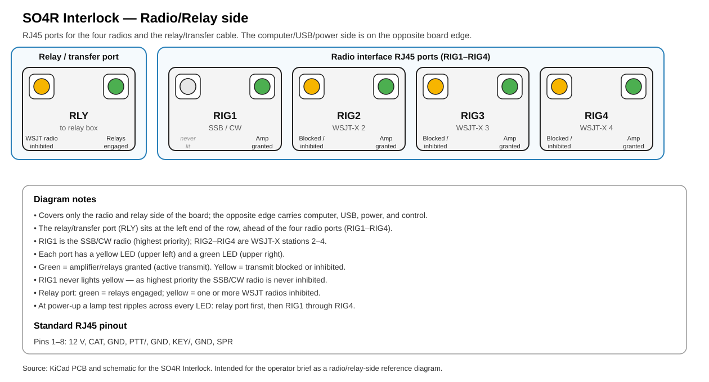

# SO4R Interlock — Operator Brief

Quick reference for **setting up, debugging, and operating** the SO4R Interlock during a
contest. Sections:

- **[RJ45 LED indicators](#rj45-led-indicators)** — what the RJ45 connector-side LEDs mean.
- **[Integration and testing](#integration-and-testing)** — staged bring-up and a test matrix.
- **[Radio interface cables](#radio-interface-cables)** — per-cable pinouts.

For the full design rationale see the top-level `README.md` and the design presentation.

---

## How it works

The Interlock enforces **one transmitter at a time** across four radios, with hot-switch
protection, by gating PTT and switching the RF transfer relays.

- **Radio 1 = SSB/CW**, requests transmit with **KEY**; **highest priority**.
- **Radios 2–4 = WSJT-X / digital**, request transmit with **RTS over USB** (the Interlock
  then drives **PTT** to the radio).
- **Priority (highest → lowest): KEY1 ▸ RTS2 ▸ RTS3 ▸ RTS4.** A higher-priority request
  immediately takes the amplifier/relays from a lower one.

Active-low signals are written with a trailing `/` (in the raw KiCad files: `{slash}`).

> **Why it's an interlock, not a sequencer:** when the SSB/CW radio asserts KEY, any WSJT
> PTT is blocked immediately and RF drops in under 1 ms — before the WSJT transfer relay
> mechanically opens — so there is no hot switching.

---

## RJ45 LED indicators

Each RJ45 jack has **two LEDs — green and yellow**. There are **four radio ports**
(RIG1–RIG4, one per radio cable) and **one relay/transfer port** (RLY, the cable to the
relay box).

This diagram shows the **RJ45 connector side** of the board; the opposite side contains
USB, computer, and power interfaces.

**At power-on** a **ripple "lamp test"** runs across every LED — yellow then green, relay
port first, then each radio port in turn — then all go dark. Seeing the sweep confirms the
MCU booted and the LEDs work.

### Radio port (RIG1–RIG4)

| LED | Meaning |
|---|---|
| **Both off** | Radio is idle (receiving); no transmit request. |
| **Green** | This radio holds priority and the **amplifier/relays + antenna** — it's the active transmitter. |
| **Yellow** | This radio is **inhibited** — transmitting (or asking to) **without** the amp/relays. |

A radio port shows green *or* yellow, never both.

**Yellow has two causes:**

1. **Blocked / waiting** — the radio asked to transmit (RTS from WSJT-X) but a
   **higher-priority radio currently holds TX**; it waits its turn.
2. **Manual TX** — the operator pressed the **radio's own TX/PTT button** (KEY with no RTS).
   The radio keys itself, but the Interlock refuses the amplifier/relays, so it transmits
   **barefoot into the pass-through antenna**. The "don't do that" indicator.

**Radio 1 (SSB/CW) shows green only** — it's highest priority, so it is never inhibited and
has no yellow.

### Relay / transfer port (RLY)

| LED | Meaning |
|---|---|
| **Green** | At least one radio is transmitting (relays engaged / system in TX). |
| **Yellow** | At least one WSJT radio is currently inhibited (blocked or manually keyed). |

### Quick mental model

- **Green = transmitting with the amplifier** (priority granted).
- **Yellow = transmit denied** — waiting behind a higher-priority radio, or keyed manually
  around the software.

---

## Integration and testing

Bring the Interlock up in **stages**, lowest risk first. Each stage has a **pass criterion
you can see** — an LED, a PTT, or a relay click — because the firmware drives every output
directly from the inputs on each pass through `loop()`. Do **not** connect the amplifier or
antennas until the logic stages (1–5) pass. RF comes last.

Every stage below is observable without test gear except the hot-switch timing check, which
wants a 2-channel scope.

### Stage 0 — Prerequisites

- **Firmware flashed.** Built and uploaded with PlatformIO (`pio run -t upload`), board
  `AVR32DB48`, serialUPDI at 115200. Serial monitor is 9600 baud.
- **FT230X USB EEPROMs named.** One-time manual step that writes a per-port ID string to
  each USB-serial chip so the ports are identifiable on the PC — see Stage 2.
- **Cables built and continuity-checked** against the [per-cable pinouts](#per-cable-pinouts).
  Check the standard RJ45 pins (esp. **PTT/ = pin 4, KEY/ = pin 6**) before plugging into a
  radio.
- **Power** applied to the Interlock and the relay box; no RF source connected yet.

### Stage 1 — Power-on self-test (no radios connected)

Apply power and watch the LEDs. The firmware runs a **lamp test**: two passes of a
yellow-then-green ripple, **relay port first**, then RIG1 → RIG2 → RIG3 → RIG4, ~30 ms per
step, then **all LEDs go dark**.

- **Pass:** ripple runs in that order and everything is dark at the end. Confirms the MCU
  booted, the LED drivers work, and every RJ45 LED is wired.
- **A LED never lights:** wiring/driver fault on that LED.
- **Ripple order wrong / a port skipped:** a jack is mislabeled or miswired — fix before
  continuing, the rest of the tests key off port identity.

### Stage 2 — USB enumeration, port naming, and PTT method

The Interlock presents **four USB-serial interfaces** (FT230X chips, one per port). Each
carries CAT to its radio and supplies the **RTS** transmit request the firmware reads.

**Manual step — name each FT230X EEPROM (one time per board).** Out of the box every FT230X
enumerates with the same default strings, so the four ports are indistinguishable on the PC.
Reprogram each chip's EEPROM **ID strings** so the ports are tellable apart:

- **Manufacturer:** `FTDI WA1HCO`
- **Product:** `FT230X SO4R Port n`, where **n = 1, 2, 3, 4** matches the radio port. (On
  Linux this shows up under `/dev/serial/by-id/` as
  `usb-FTDI_WA1HCO_FT230X_SO4R_Port_n-...`.)

This only changes the descriptor **strings**; the USB hex IDs stay at the FT230X default
**VID = 0x0403, PID = 0x6015** (a CAUTION worth remembering — the VID/PID are *not* unique
per port, only the strings are). Full procedure and screenshots are in the design
presentation, `SO4R_Interlock.odp` (top of repo).

> The original naming was a one-time bench step and the exact utility used was not recorded.
> To re-name a replacement board, any FTDI EEPROM tool works — **FT_PROG** (Windows) or
> **`ftdi_eeprom`** (Linux) are the usual choices for writing FT230X string descriptors.

**Verify / find each port:**

- **Windows:** Device Manager shows only the default name derived from VID/PID, **not** the
  programmed strings. Use **USBTreeView** (<https://www.uwe-sieber.de/usbtreeview_e.html>) to
  read the real `SO4R Port n` strings and map each to its COM port.
- **Linux:** the strings appear under `/dev/serial/by-id/` (and in `dmesg`/`udevadm`), which
  ties each `/dev/ttyUSB*` to its `SO4R Port n`.

**PTT method:** WSJT-X radios (2–4) request transmit with **RTS** — set each WSJT-X
instance's **PTT method to RTS** (not CAT, not VOX) on the COM/tty you identified above. On
Windows, CAT and RTS may need **separate COM ports**.

**RTS1 is intentionally ignored** by the firmware, so radio 1's serial port can be opened,
programmed, or run CAT without ever keying the amp. (Radio 1 keys via its **KEY** line.)

- **Pass:** each port is identifiable as `SO4R Port n`, each WSJT-X instance toggles RTS on
  its assigned port, and you can see it at the Interlock in Stage 4.

### Stage 3 — Idle check (one radio at a time, receiving)

Connect one radio, leave it in receive.

- **Pass:** **both LEDs off** on that radio's port; no PTT to the radio, no relay engaged.
- A LED on at idle means a stuck/inverted KEY or RTS line — trace pin 6 (KEY/) and pin 4
  (PTT/).

### Stage 4 — Single-radio transmit (each radio alone, no others keyed)

| Radio | How to key | Expect |
|---|---|---|
| **RIG1 (SSB/CW)** | key the radio (KEY1) | RIG1 **green**, RLY **green**, **RLY1** relay engaged. **No PTT** asserted by the Interlock — the SSB/CW radio keys its own amp via KEY. |
| **RIG2–4 (WSJT)** | assert RTS (WSJT-X *Tune*, or a PTT test) | that rig **green**, RLY **green**, **PTT** asserted to that radio, that **RLYn** relay engaged. |

Release the request → everything for that port drops within one `loop()` pass.

- **Pass:** exactly the expected port goes green, the matching relay engages, and (for WSJT)
  PTT reaches the radio. Nothing else moves.

### Stage 5 — Priority and interlock (the core behavior)

Priority is **KEY1 ▸ RTS2 ▸ RTS3 ▸ RTS4** (highest → lowest). Verify preemption with two
requests at once:

- **Lower then higher:** hold **RTS4**, then assert **RTS2**. Priority moves to RIG2 — RIG2
  green, **RIG4 turns yellow** (blocked), PTT4 drops, PTT2 asserts, relays switch to 2.
- **SSB/CW preempts everything:** with a WSJT radio transmitting, **key RIG1**. RIG1 goes
  green and takes the relays immediately; the WSJT radio's port goes **yellow** and its PTT
  drops. This is the no-hot-switch guarantee.
- **Manual-TX corner case:** press the **TX/PTT button on a WSJT radio directly** (KEYn with
  no RTSn). That port goes **yellow**, the Interlock refuses the relays/amp, and the radio
  transmits **barefoot into the pass-through antenna**. Confirm the transfer relays stay in
  pass-through.
- **Relay-port aggregate LED:** RLY **green** whenever any radio is transmitting; RLY
  **yellow** whenever any WSJT radio is inhibited (blocked or manually keyed).

- **Pass:** in every combination, only the highest-priority requester holds green + relays;
  every outranked or manually-keyed WSJT radio shows yellow and never gets a relay.

### Stage 6 — RF and amplifier integration (last, low power, dummy load)

Only after Stages 1–5 pass. Start into a **dummy load at low power**.

- Confirm the **transfer relays route the correct antenna/amplifier** to the active radio and
  leave inhibited radios on the pass-through.
- **Hot-switch timing check (scope):** on release of PTT, RF stops first and the relays hold
  for a few ms, so they never switch hot. On SSB/CW preemption of a WSJT radio, RF must drop
  **before** the WSJT transfer relay mechanically opens — the design target is well under
  1 ms (RF through the 2.5 kHz filters is delayed < 1 ms; the firmware reacts in one `loop()`
  pass). Verify on the bench before trusting it on the air.

> **Assumptions to verify on your bench:** the < 1 ms figure and the relay hold time come
> from the design comments in `src/main.cpp`, not from a measurement on your unit. The
> per-pass `loop()` latency is not yet characterized. Treat Stage 6 as *measure, don't
> assume*.

### Bench helpers (no radio needed)

Two small pyserial scripts in [`tools/`](../tools/) drive the **RTS** lines over USB so you
can exercise the LEDs and the priority logic from a PC, without keying a radio. Run them
from the `Software/` directory against the `SO4R Port n` tty (find it under
`/dev/serial/by-id/`):

- **`tools/rts_toggle.py <tty> [on_s] [off_s] [cycles]`** — assert/release RTS on one port.
  Expect that port's **green** to track the asserted windows.
- **`tools/priority_demo.py <low_tty> <high_tty> [dwell_s]`** — assert a lower-priority port,
  then a higher one on top, then release in reverse. Expect the higher port to take **green**
  while the lower flips to **yellow**, then recover.

To exercise **KEY1 (SSB/CW) preemption**, hold RTS on a WSJT port with `rts_toggle.py` and
key radio 1 by hand: RIG1 takes green, the WSJT port goes yellow, and recovers when KEY1
releases. (This whole bring-up was verified on hardware this way.)

### Test matrix (logic stages)

Stimulus → expected outputs, for one radio acting alone (Stages 3–4) and the key preemption
cases (Stage 5). "—" = not asserted.

| Stimulus | Port green | Port yellow | PTT to radio | Relay engaged | RLY grn | RLY yel |
|---|---|---|---|---|---|---|
| All idle | — | — | — | — | off | off |
| RIG1 KEY1 | RIG1 | — | — *(none)* | RLY1 | on | off |
| RIG2 RTS2 | RIG2 | — | PTT2 | RLY2 | on | off |
| RIG2 manual TX (KEY2, no RTS2) | — | RIG2 | — | — *(pass-thru)* | off | on |
| RTS4 then RTS2 | RIG2 | RIG4 | PTT2 | RLY2 | on | on |
| WSJT TX, then KEY1 | RIG1 | the WSJT rig | — for RIG1 | RLY1 | on | on |

---

## Radio interface cables

Pin tables are extracted from the KiCad netlist (authoritative connectivity), not hand-read
from the schematic.

> Source of truth: the KiCad project in `Hardware/Radio_Interface_Cables/`. Regenerate the
> connectivity with:
> `kicad-cli sch export netlist --format kicadxml Radio_Interface_Cables.kicad_sch`
>
> **Project structure (after sheet cleanup):** `Radio_Interface_Cables.kicad_pro` is one
> hierarchical project. The Root sheet is an **index** holding one sheet symbol per cable;
> each cable lives on its own sub-sheet: `IC-9700`, `IC-9100`, `IC-746PRO`, `K3S`, `K4`.

Each cable adapts **one radio's accessory connectors** to the Interlock over a single
**RJ45** link.

### Standard Interlock RJ45 pinout (all five cables)

The RJ45 (Interlock end) is wired **identically on every cable** — this is the Interlock's
standard radio port. Check these pins first when debugging:

| RJ45 pin | 1 | 2 | 3 | 4 | 5 | 6 | 7 | 8 |
|---|---|---|---|---|---|---|---|---|
| Signal | 12 V | CAT | GND | **PTT/** | GND | **KEY/** | GND | SPR |

### Cable connector inventory

Every cable runs **radio connectors ⟶ RJ45 ⟶ Interlock**. One RJ45 per cable.

| Cable | Radio-end connectors |
|---|---|
| **IC-9700** | ACC (DIN-8), 6.25 mm plug, 3.5 mm plug |
| **IC-9100** | ACC (DIN-13), 6.25 mm plug + jack, 3.5 mm plug |
| **IC-746PRO** | ACC1 (DIN-8), ACC2 (DIN-7), 6.25 mm plug + jack, 3.5 mm plug |
| **K3S** | ACC (DE15 HD-15), PowerPole, 6.25 mm plug + jack |
| **K4** | ACC (DE15 HD-15), PowerPole, 6.25 mm plug + jack |

### Per-cable pinouts

Full as-wired pinout per cable. "RJ45" = Interlock-end pin (see standard pinout above); "–"
= not on the RJ45. "Radio end" = where the signal lands on the radio side. The 6.25 mm and
3.5 mm audio connectors are 2-conductor (TS): **Tip** carries the signal, **Sleeve** is
grounded.

#### IC-9700  (Icom)

| Signal | RJ45 | Radio end |
|---|---|---|
| 12 V  | 1 | DIN-8 p7 |
| CAT   | 2 | 3.5 mm plug Tip |
| PTT/  | 4 | 6.25 mm plug Tip |
| KEY/  | 6 | DIN-8 p3 |
| SPR   | 8 | DIN-8 p6 |
| MOD   | – | DIN-8 p4 |
| AF/IF | – | DIN-8 p5 |
| ALC   | – | DIN-8 p8 |
| RTTY  | – | DIN-8 p1 |
| GND   | 3, 5, 7 | DIN-8 p2; plug sleeves |

#### IC-9100  (Icom)

| Signal | RJ45 | Radio end |
|---|---|---|
| 12 V   | 1 | DIN-13 p8 |
| CAT    | 2 | 3.5 mm plug Tip |
| PTT/   | 4 | 6.25 mm plug Tip; 6.25 mm jack Tip |
| KEY/   | 6 | *(RJ45 only)* |
| SPR    | 8 | DIN-13 p13 |
| 8 V    | – | DIN-13 p1 |
| AF     | – | DIN-13 p12 |
| MOD    | – | DIN-13 p11 |
| ALC    | – | DIN-13 p6 |
| BAND   | – | DIN-13 p5 |
| HSEND/ | – | DIN-13 p3 |
| VSEND/ | – | DIN-13 p7 |
| RTTY   | – | DIN-13 p10 |
| GND    | 3, 5, 7 | DIN-13 p2; plug/jack sleeves |

*(DIN-13 pins 4 and 9 are no-connect.)*

#### IC-746PRO  (Icom)

| Signal | RJ45 | Radio end |
|---|---|---|
| 12 V   | 1 | ACC1 (DIN-8) p7; ACC2 (DIN-7) p7 |
| CAT    | 2 | 3.5 mm plug Tip |
| PTT/   | 4 | 6.25 mm plug Tip; 6.25 mm jack Tip |
| KEY/   | 6 | *(RJ45 only)* |
| SPR    | 8 | ACC1 (DIN-8) p6 |
| 8 V    | – | ACC2 (DIN-7) p1 |
| AF     | – | ACC1 (DIN-8) p5 |
| MOD    | – | ACC1 (DIN-8) p4 |
| ALC    | – | ACC1 (DIN-8) p8; ACC2 (DIN-7) p5 |
| BAND   | – | ACC2 (DIN-7) p4 |
| HSEND/ | – | ACC1 (DIN-8) p3; ACC2 (DIN-7) p3 |
| VSEND/ | – | ACC2 (DIN-7) p6 |
| RTTY   | – | ACC1 (DIN-8) p1 |
| GND    | 3, 5, 7 | ACC1 p2; ACC2 p2; plug/jack sleeves |

#### K3S  (Elecraft)

| Signal | RJ45 | Radio end |
|---|---|---|
| 12 V    | 1 | *(RJ45 only)* |
| CAT     | 2 | *(RJ45 only)* |
| PTT/    | 4 | DE15 p4; 6.25 mm jack Tip; 6.25 mm plug Tip |
| KEY/    | 6 | DE15 p10 |
| SPR     | 8 | *(RJ45 only)* |
| 13.8 V  | – | PowerPole p1 |
| ALC     | – | DE15 p15 |
| AUXBUS  | – | DE15 p2 |
| BAND0   | – | DE15 p13 |
| BAND1   | – | DE15 p3 |
| BAND2   | – | DE15 p9 |
| BAND3   | – | DE15 p14 |
| DIGOUT0 | – | DE15 p6 |
| DIGOUT1 | – | DE15 p11 |
| K3S_ON  | – | DE15 p7 |
| PWR_ON  | – | DE15 p8 |
| RTTY    | – | DE15 p1 |
| GND     | 3, 5, 7 | DE15 p5, p12; PowerPole p2; plug/jack sleeves |

#### K4  (Elecraft)

| Signal | RJ45 | Radio end |
|---|---|---|
| 12 V    | 1 | PowerPole p1 |
| CAT     | 2 | *(RJ45 only)* |
| PTT/    | 4 | DE15 p4; 6.25 mm jack Tip; 6.25 mm plug Tip |
| KEY/    | 6 | DE15 p10 |
| SPR     | 8 | *(RJ45 only)* |
| ALC     | – | DE15 p15 |
| AUXBUS  | – | DE15 p2 |
| BAND0   | – | DE15 p13 |
| BAND1   | – | DE15 p3 |
| BAND2   | – | DE15 p9 |
| BAND3   | – | DE15 p14 |
| DIGOUT0 | – | DE15 p6 |
| DIGOUT1 | – | DE15 p11 |
| PWR_ON  | – | DE15 p8 |
| RTTY    | – | DE15 p1 |
| **TX_INH** | – | DE15 p7 |
| GND     | 3, 5, 7 | DE15 p5, p12; PowerPole p2; plug/jack sleeves |

### Notes for setup / debug

- **KEY/ and PTT/** are the lines the Interlock acts on — check RJ45 pins 6 and 4 first if
  a radio won't key the amp/relays or won't release.
- **KEY/ to the radio** is wired through only on IC-9700 (DIN-8 p3) and the Elecraft cables
  (DE15 p10). On **IC-9100 / IC-746PRO, KEY/ stops at the RJ45** — those radios are keyed
  via PTT. Worth knowing when tracing a no-key fault.
- **PTT/** is also broken out to the **6.25 mm plug and jack** on every cable (and DE15 p4
  on the Elecrafts) — a footswitch/external-PTT tap in parallel with the Interlock.

### Caveats

- Pinouts reflect the **as-wired netlist** of the current schematic. They describe what the
  cable *does*, which may differ from the radio manual's intended ACC pinout — verify
  suspicious signals.
- Reference designators (`J#`) are intentionally omitted; the tables key on connector type
  and pin, so they survive re-annotation after the sheet cleanup.
